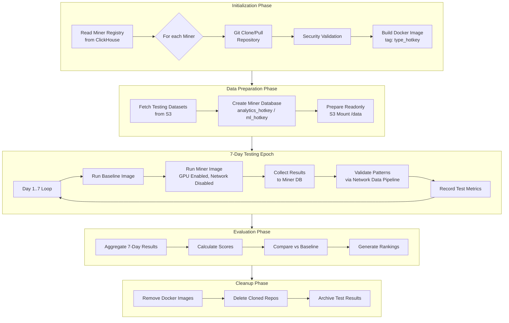
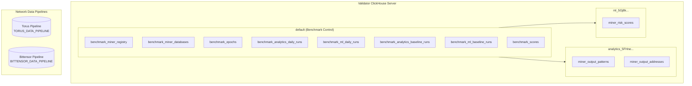
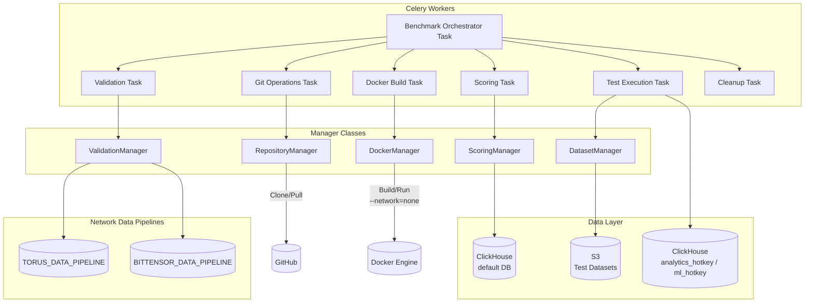
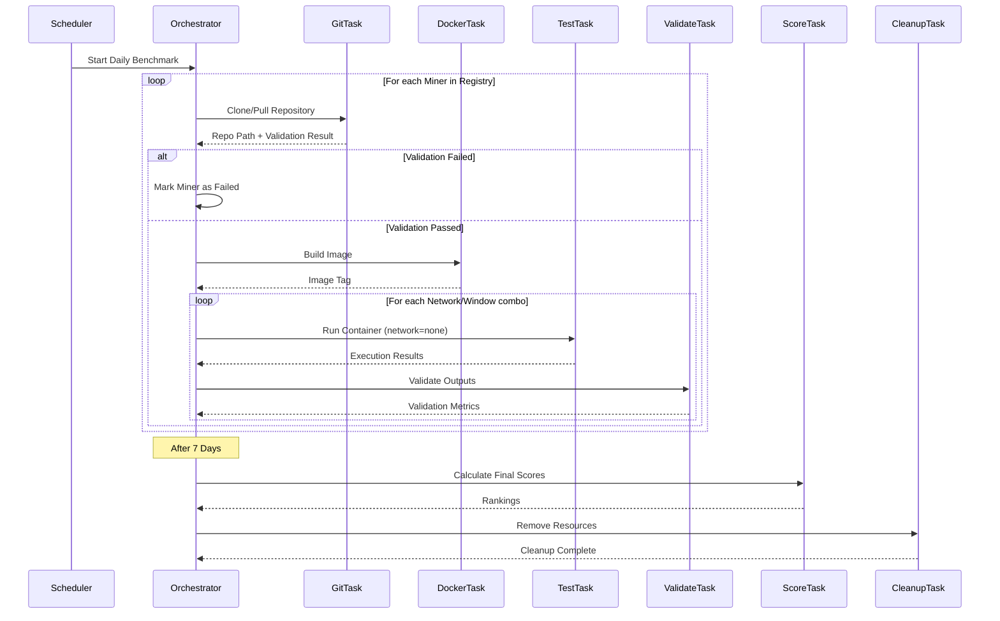

# Miner Benchmark System - Architecture Design

## Overview

This document describes the workflow and architecture for the **Miner Benchmark System**, which evaluates miners submitting Docker-based analytics/ML solutions against synthetic blockchain transaction patterns.

---

## High-Level Workflow



---

## Database Architecture

### ClickHouse Database Layout



---

## Database Schema (ClickHouse - default database)

### 1. Miner Registry Table
```sql
CREATE TABLE IF NOT EXISTS benchmark_miner_registry (
    hotkey String,
    image_type Enum('analytics', 'ml'),
    github_repository String,
    registered_at DateTime DEFAULT now(),
    last_updated_at DateTime DEFAULT now(),
    status Enum('pending', 'active', 'disabled', 'failed') DEFAULT 'pending',
    validation_error Nullable(String)
) ENGINE = ReplacingMergeTree(last_updated_at)
ORDER BY (hotkey, image_type);
```

### 2. Miner Databases Tracking Table
```sql
CREATE TABLE IF NOT EXISTS benchmark_miner_databases (
    hotkey String,
    image_type Enum('analytics', 'ml'),
    database_name String,
    created_at DateTime DEFAULT now(),
    last_used_at DateTime DEFAULT now(),
    status Enum('active', 'archived', 'deleted') DEFAULT 'active'
) ENGINE = ReplacingMergeTree(last_used_at)
ORDER BY (hotkey, image_type);
```

### 3. Benchmark Epochs Table
```sql
CREATE TABLE IF NOT EXISTS benchmark_epochs (
    epoch_id UUID DEFAULT generateUUIDv4(),
    hotkey String,
    image_type Enum('analytics', 'ml'),
    start_date Date,
    end_date Date,
    status Enum('pending', 'running', 'completed', 'failed') DEFAULT 'pending',
    docker_image_tag String,
    miner_database_name String,
    created_at DateTime DEFAULT now(),
    completed_at Nullable(DateTime)
) ENGINE = MergeTree()
ORDER BY (hotkey, start_date);
```

### 4. Analytics Daily Runs Table
```sql
CREATE TABLE IF NOT EXISTS benchmark_analytics_daily_runs (
    run_id UUID DEFAULT generateUUIDv4(),
    epoch_id UUID,
    hotkey String,
    test_date Date,
    network String,
    window_days UInt16,
    processing_date Date,
    
    execution_time_seconds Float64,
    container_exit_code Int32,
    gpu_memory_peak_mb Float64,
    
    synthetic_patterns_expected UInt32,
    synthetic_patterns_found UInt32,
    synthetic_patterns_recall Float64,
    
    novelty_patterns_reported UInt32,
    novelty_patterns_validated UInt32,
    novelty_addresses_valid Bool,
    novelty_connections_valid Bool,
    
    all_addresses_exist Bool,
    all_connections_exist Bool,
    data_correctness_passed Bool,
    
    status Enum('pending', 'running', 'completed', 'timeout', 'failed') DEFAULT 'pending',
    error_message Nullable(String),
    
    created_at DateTime DEFAULT now()
) ENGINE = MergeTree()
ORDER BY (epoch_id, test_date, network);
```

### 5. ML Daily Runs Table
```sql
CREATE TABLE IF NOT EXISTS benchmark_ml_daily_runs (
    run_id UUID DEFAULT generateUUIDv4(),
    epoch_id UUID,
    hotkey String,
    test_date Date,
    network String,
    window_days UInt16,
    processing_date Date,
    
    execution_time_seconds Float64,
    container_exit_code Int32,
    gpu_memory_peak_mb Float64,
    
    auc_roc Float64,
    precision_at_recall_80 Float64,
    
    all_addresses_exist Bool,
    data_correctness_passed Bool,
    
    status Enum('pending', 'running', 'completed', 'timeout', 'failed') DEFAULT 'pending',
    error_message Nullable(String),
    
    created_at DateTime DEFAULT now()
) ENGINE = MergeTree()
ORDER BY (epoch_id, test_date, network);
```

### 6. Analytics Baseline Runs Table
```sql
CREATE TABLE IF NOT EXISTS benchmark_analytics_baseline_runs (
    run_id UUID DEFAULT generateUUIDv4(),
    baseline_version String,
    test_date Date,
    network String,
    window_days UInt16,
    processing_date Date,
    
    execution_time_seconds Float64,
    synthetic_patterns_expected UInt32,
    synthetic_patterns_found UInt32,
    synthetic_patterns_recall Float64,
    
    created_at DateTime DEFAULT now()
) ENGINE = MergeTree()
ORDER BY (baseline_version, test_date, network);
```

### 7. ML Baseline Runs Table
```sql
CREATE TABLE IF NOT EXISTS benchmark_ml_baseline_runs (
    run_id UUID DEFAULT generateUUIDv4(),
    baseline_version String,
    test_date Date,
    network String,
    window_days UInt16,
    processing_date Date,
    
    execution_time_seconds Float64,
    auc_roc Float64,
    precision_at_recall_80 Float64,
    
    created_at DateTime DEFAULT now()
) ENGINE = MergeTree()
ORDER BY (baseline_version, test_date, network);
```

### 8. Final Scores Table
```sql
CREATE TABLE IF NOT EXISTS benchmark_scores (
    epoch_id UUID,
    hotkey String,
    image_type Enum('analytics', 'ml'),
    
    data_correctness_all_days Bool,
    
    pattern_accuracy_score Float64,
    data_correctness_score Float64,
    performance_score Float64,
    
    final_score Float64,
    rank UInt32,
    
    baseline_comparison_ratio Float64,
    
    all_runs_within_time_limit Bool,
    average_execution_time_seconds Float64,
    
    calculated_at DateTime DEFAULT now()
) ENGINE = ReplacingMergeTree(calculated_at)
ORDER BY (hotkey, image_type);
```

---

## Miner Database Schema

Each miner gets a dedicated database with naming convention:
- Analytics miners: `analytics_{hotkey}`
- ML miners: `ml_{hotkey}`

### Analytics Miner Output Tables
```sql
-- Database: analytics_{hotkey}

CREATE TABLE IF NOT EXISTS miner_output_patterns (
    pattern_id String,
    pattern_type String,
    addresses Array(String),
    transactions Array(String),
    confidence Float64,
    detected_at DateTime DEFAULT now()
) ENGINE = MergeTree()
ORDER BY (pattern_type, detected_at);

CREATE TABLE IF NOT EXISTS miner_output_addresses (
    address String,
    risk_label String,
    risk_score Float64,
    pattern_ids Array(String),
    created_at DateTime DEFAULT now()
) ENGINE = MergeTree()
ORDER BY (risk_label, address);
```

### ML Miner Output Tables
```sql
-- Database: ml_{hotkey}

CREATE TABLE IF NOT EXISTS miner_risk_scores (
    address String,
    risk_score Float64,
    model_version String,
    created_at DateTime DEFAULT now()
) ENGINE = MergeTree()
ORDER BY (address);
```

---

## Configuration (Environment Variables)

```bash
# Validator ClickHouse (uses default database)
VALIDATOR_CH_HOST=localhost
VALIDATOR_CH_PORT=9000
VALIDATOR_CH_DATABASE=default

# Network-specific Data Pipelines
TORUS_DATA_PIPELINE_CH_HOST=torus-pipeline-clickhouse
TORUS_DATA_PIPELINE_CH_PORT=9000
TORUS_DATA_PIPELINE_CH_DATABASE=pipeline

BITTENSOR_DATA_PIPELINE_CH_HOST=bittensor-pipeline-clickhouse
BITTENSOR_DATA_PIPELINE_CH_PORT=9000
BITTENSOR_DATA_PIPELINE_CH_DATABASE=pipeline

# Benchmark Settings
BENCHMARK_REPOS_PATH=/var/benchmark/repos
BENCHMARK_DATA_PATH=/var/benchmark/data
BENCHMARK_MAX_EXECUTION_TIME=3600
BENCHMARK_EPOCH_DAYS=7

# Docker Configuration
DOCKER_HOST=unix:///var/run/docker.sock
BENCHMARK_BASE_IMAGES=python:3.11-slim,nvidia/cuda:12.1-runtime-ubuntu22.04
```

---

## Component Architecture



---

## Detailed Component Specifications

### 1. RepositoryManager

```python
class RepositoryManager:
    def clone_or_pull(self, hotkey: str, repo_url: str) -> Path
    def validate_repository(self, repo_path: Path) -> ValidationResult
    def check_obfuscation(self, repo_path: Path) -> bool
    def scan_malware(self, repo_path: Path) -> ScanResult
    def cleanup_repository(self, hotkey: str) -> None
```

### 2. DockerManager

```python
class DockerManager:
    def build_image(self, repo_path: Path, image_type: str, hotkey: str) -> str
    def run_container(
        self, 
        image_tag: str, 
        data_mount: Path, 
        miner_database: str,
        timeout: int = 3600,
        network_mode: str = "none"
    ) -> ContainerResult
    def remove_image(self, image_tag: str) -> None
```

Container Execution:
```bash
docker run \
    --network=none \
    --gpus all \
    --memory=32g \
    --read-only \
    --tmpfs /tmp:rw,size=1g \
    -v /data:/data:ro \
    -e CLICKHOUSE_HOST=${VALIDATOR_CH_HOST} \
    -e CLICKHOUSE_PORT=${VALIDATOR_CH_PORT} \
    -e CLICKHOUSE_DATABASE=${miner_database} \
    ${IMAGE_TAG}
```

### 3. DatasetManager

```python
class DatasetManager:
    def fetch_dataset(self, network: str, processing_date: str, window_days: int) -> Path
    def prepare_miner_mount(self, dataset_path: Path) -> Path
    def create_miner_database(self, hotkey: str, image_type: str) -> str
    def get_ground_truth(self, network: str, processing_date: str, window_days: int) -> DataFrame
    def get_data_pipeline_client(self, network: str) -> Client
```

Database Naming:
```python
def create_miner_database(self, hotkey: str, image_type: str) -> str:
    database_name = f"{image_type}_{hotkey}"
    return database_name
```

S3 Mount Rules (to /data):
```
transfers.parquet        -> MOUNT
address_labels.parquet   -> MOUNT
assets.parquet           -> MOUNT
asset_prices.parquet     -> MOUNT
ground_truth.parquet     -> NEVER MOUNT (validator only)
META.json                -> NEVER MOUNT
```

### 4. ValidationManager

```python
class ValidationManager:
    def __init__(self):
        self.pipeline_clients = {
            'torus': self._get_pipeline_client('TORUS'),
            'bittensor': self._get_pipeline_client('BITTENSOR'),
        }
    
    def _get_pipeline_client(self, network: str) -> Client:
        host = os.environ[f'{network}_DATA_PIPELINE_CH_HOST']
        port = int(os.environ[f'{network}_DATA_PIPELINE_CH_PORT'])
        database = os.environ[f'{network}_DATA_PIPELINE_CH_DATABASE']
        return get_client(host=host, port=port, database=database)
    
    def validate_addresses_exist(self, addresses: List[str], network: str) -> bool
    def validate_connections_exist(self, connections: List[Tuple], network: str) -> bool
    def compare_synthetic_patterns(self, miner_patterns: List, ground_truth_s3: DataFrame) -> RecallMetrics
    def validate_novelty_patterns(self, patterns: List, network: str) -> NoveltyResult
```

Validation Rules:
1. Synthetic patterns: Compare ONLY against S3 ground_truth dataset
2. Novelty patterns: Validate via Network Data Pipeline ClickHouse
   - All reported addresses MUST exist in pipeline
   - All reported connections MUST exist in pipeline
   - ANY false data = automatic score 0

### 5. ScoringManager

```python
class ScoringManager:
    def calculate_daily_score(self, run: DailyRun) -> DailyScore
    def aggregate_epoch_score(self, epoch_id: UUID) -> EpochScore
    def calculate_rankings(self, image_type: str) -> List[RankedMiner]
```

Scoring Formula:
```python
def calculate_final_score(epoch_results: List[DailyRun]) -> float:
    for run in epoch_results:
        if not run.all_addresses_exist or not run.all_connections_exist:
            return 0.0
    
    for run in epoch_results:
        if run.execution_time_seconds > MAX_EXECUTION_TIME:
            return 0.0
    
    pattern_accuracy = mean([r.synthetic_patterns_recall for r in epoch_results])
    novelty_score = mean([r.novelty_patterns_validated / r.novelty_patterns_reported for r in epoch_results])
    performance_ratio = baseline_avg_time / miner_avg_time
    
    final_score = (
        0.50 * pattern_accuracy +
        0.30 * novelty_score +
        0.20 * min(performance_ratio, 1.0)
    )
    
    return final_score
```

---

## Celery Task Flow



---

## Test Dataset Matrix

| Network | Window Days | Purpose |
|---------|-------------|---------|
| torus | 30 | Small dataset |
| torus | 90 | Medium dataset |
| bittensor | 30 | Subnet-specific |
| bittensor | 90 | Larger patterns |

---

## Security Validation Rules

### Repository Validation Checks

1. Origin Verification:
   - Must be from `github.com` domain
   - Must be a public repository or have valid auth

2. Obfuscation Detection:
   - No base64 encoded Python code
   - No minified/uglified Python files
   - No binary executables (except: `.so`, `.pyd` from pip packages)
   
3. Malware Scanning:
   - No cryptocurrency miners
   - No shell scripts with `curl | bash` patterns
   - No outbound network calls in Dockerfile RUN commands
   - Restricted base images (must be from approved list)

4. Template Structure:
   - Must contain `Dockerfile`
   - Dockerfile must use approved base images
   - Must have deterministic builds (pinned versions)

### Container Isolation

```bash
docker run \
    --network=none \
    --gpus all \
    --memory=32g \
    --read-only \
    --tmpfs /tmp:rw,size=1g \
    -v /data:/data:ro \
    -e CLICKHOUSE_HOST=... \
    -e CLICKHOUSE_PORT=... \
    -e CLICKHOUSE_DATABASE=... \
    ${IMAGE_TAG}
```

---

## Package Structure

```
packages/
├── benchmark/
│   ├── __init__.py
│   ├── managers/
│   │   ├── __init__.py
│   │   ├── repository_manager.py
│   │   ├── docker_manager.py
│   │   ├── dataset_manager.py
│   │   ├── validation_manager.py
│   │   └── scoring_manager.py
│   ├── models/
│   │   ├── __init__.py
│   │   ├── miner.py
│   │   ├── epoch.py
│   │   └── results.py
│   └── security/
│       ├── __init__.py
│       ├── code_scanner.py
│       └── malware_scanner.py
│
├── jobs/
│   └── tasks/
│       ├── benchmark_orchestrator_task.py
│       ├── benchmark_git_task.py
│       ├── benchmark_docker_task.py
│       ├── benchmark_test_execution_task.py
│       ├── benchmark_validation_task.py
│       ├── benchmark_scoring_task.py
│       └── benchmark_cleanup_task.py
│
├── storage/
│   ├── repositories/
│   │   ├── miner_registry_repository.py
│   │   ├── miner_database_repository.py
│   │   ├── benchmark_epoch_repository.py
│   │   └── benchmark_results_repository.py
│   └── schema/
│       └── benchmark/
│           ├── benchmark_miner_registry.sql
│           ├── benchmark_miner_databases.sql
│           ├── benchmark_epochs.sql
│           ├── benchmark_analytics_daily_runs.sql
│           ├── benchmark_ml_daily_runs.sql
│           ├── benchmark_analytics_baseline_runs.sql
│           ├── benchmark_ml_baseline_runs.sql
│           ├── benchmark_scores.sql
│           ├── miner_analytics_schema.sql
│           └── miner_ml_schema.sql