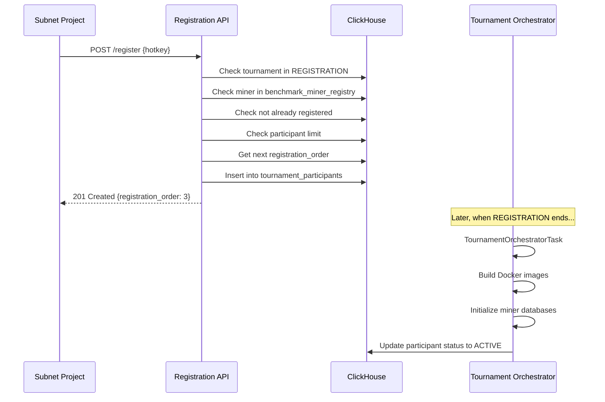

# Miner Registration API Design

This document describes the internal API for miner registration to tournaments. This API is separate from the read-only UI API for security reasons.

## 1. Architecture Overview

```
┌─────────────────────────────────────────────────────────────────────────────┐
│                              API SEPARATION                                  │
├─────────────────────────────────────────────────────────────────────────────┤
│                                                                             │
│  ┌─────────────────────────┐         ┌─────────────────────────┐           │
│  │   READ-ONLY UI API      │         │   REGISTRATION API       │           │
│  │   (Public/Frontend)     │         │   (Internal/Subnet)      │           │
│  ├─────────────────────────┤         ├─────────────────────────┤           │
│  │ /api/v1/tournaments     │         │ /api/internal/register  │           │
│  │ GET only                │         │ POST only               │           │
│  │ No authentication       │         │ API Key required        │           │
│  │ Port: 8080             │         │ Port: 8081              │           │
│  └─────────────────────────┘         └─────────────────────────┘           │
│                                                                             │
└─────────────────────────────────────────────────────────────────────────────┘
```

## 2. Simple Registration Flow

The API just creates a database entry. Heavy work (Docker build, etc.) is handled by Celery's `TournamentOrchestratorTask` when the tournament starts.



## 3. API Endpoints

### Internal Registration API

**Base URL:** `/api/internal`  
**Authentication:** API Key (`X-API-Key` header)  
**Port:** 8081 (separate from public API)

---

### 3.1 Register for Tournament

**Endpoint:** `POST /api/internal/tournaments/{tournament_id}/register`

**Headers:**
```
X-API-Key: <subnet_api_key>
Content-Type: application/json
```

**Request Body:**
```json
{
  "hotkey": "5FHneW46xGXgs5mUiveU4sbTyGBzmstUspZC92UhjJM694ty"
}
```

**Response (201 Created):**
```json
{
  "tournament_id": "660e8400-e29b-41d4-a716-446655440001",
  "hotkey": "5FHneW46xGXgs5mUiveU4sbTyGBzmstUspZC92UhjJM694ty",
  "registration_order": 3,
  "status": "registered",
  "registered_at": "2025-01-02T10:10:00Z"
}
```

**Error Responses:**

| Status | Code | Description |
|--------|------|-------------|
| 400 | INVALID_REQUEST | Missing required fields |
| 401 | UNAUTHORIZED | Missing or invalid API key |
| 403 | NOT_REGISTRATION_PERIOD | Tournament not in REGISTRATION status |
| 404 | TOURNAMENT_NOT_FOUND | Tournament does not exist |
| 404 | MINER_NOT_FOUND | Miner not in benchmark_miner_registry |
| 409 | ALREADY_REGISTERED | Miner already registered for this tournament |
| 422 | MAX_PARTICIPANTS | Maximum participants reached |

---

### 3.2 Check Registration Status

**Endpoint:** `GET /api/internal/tournaments/{tournament_id}/participants/{hotkey}`

**Response:**
```json
{
  "tournament_id": "660e8400-e29b-41d4-a716-446655440001",
  "hotkey": "5FHneW46xGXgs5mUiveU4sbTyGBzmstUspZC92UhjJM694ty",
  "participant_type": "miner",
  "registration_order": 3,
  "status": "registered",
  "registered_at": "2025-01-02T10:10:00Z",
  "github_repository": "https://github.com/miner123/analytics-solution",
  "docker_image_tag": null,
  "miner_database_name": null
}
```

---

### 3.3 Unregister from Tournament

**Endpoint:** `DELETE /api/internal/tournaments/{tournament_id}/participants/{hotkey}`

**Response (204 No Content)**

**Note:** Only allowed during REGISTRATION period. Once tournament is IN_PROGRESS, cannot unregister.

---

## 4. Validation Logic

```python
def validate_registration(tournament_id: UUID, hotkey: str):
    # 1. Check tournament exists and is in REGISTRATION status
    tournament = tournament_repo.get_tournament_by_id(tournament_id)
    if not tournament:
        raise NotFoundError("TOURNAMENT_NOT_FOUND")
    if tournament.status != TournamentStatus.REGISTRATION:
        raise ForbiddenError("NOT_REGISTRATION_PERIOD")
    
    # 2. Check miner exists in platform registry
    miner = miner_registry_repo.get_miner(hotkey, tournament.image_type)
    if not miner or miner.status != 'active':
        raise NotFoundError("MINER_NOT_FOUND")
    
    # 3. Check not already registered
    existing = tournament_repo.get_participant(tournament_id, hotkey)
    if existing:
        raise ConflictError("ALREADY_REGISTERED")
    
    # 4. Check participant limit
    participants = tournament_repo.get_participants(tournament_id)
    miner_count = len([p for p in participants if p.participant_type.value == 'miner'])
    if miner_count >= tournament.max_participants:
        raise UnprocessableError("MAX_PARTICIPANTS")
```

---

## 5. Security

### API Key Authentication

```python
import os
from fastapi import Header, HTTPException

REGISTRATION_API_KEY = os.environ.get('REGISTRATION_API_KEY')

async def verify_api_key(x_api_key: str = Header(...)):
    if x_api_key != REGISTRATION_API_KEY:
        raise HTTPException(status_code=401, detail="Invalid API key")
```

### Network Isolation

The registration API runs on a separate port (8081) and should only be accessible from internal network or localhost.

```yaml
# docker-compose.yml
services:
  registration-api:
    ports:
      - "127.0.0.1:8081:8081"  # Localhost only
    environment:
      - REGISTRATION_API_KEY=${REGISTRATION_API_KEY}
```

---

## 6. Implementation Files

| File | Purpose |
|------|---------|
| `packages/api/routers/registration_router.py` | API endpoints |
| `packages/api/models/registration_responses.py` | Pydantic models |
| `packages/api/services/registration_service.py` | Business logic |

---

## 7. Heavy Work - Handled by Celery

The `TournamentOrchestratorTask` handles heavy work when tournament transitions from REGISTRATION → IN_PROGRESS:

1. **Docker Build** - Builds Docker images for each participant
2. **Database Init** - Creates miner-specific databases
3. **Status Update** - Updates participant status to ACTIVE

See [`packages/jobs/tasks/tournament_orchestrator_task.py`](../packages/jobs/tasks/tournament_orchestrator_task.py) for implementation.