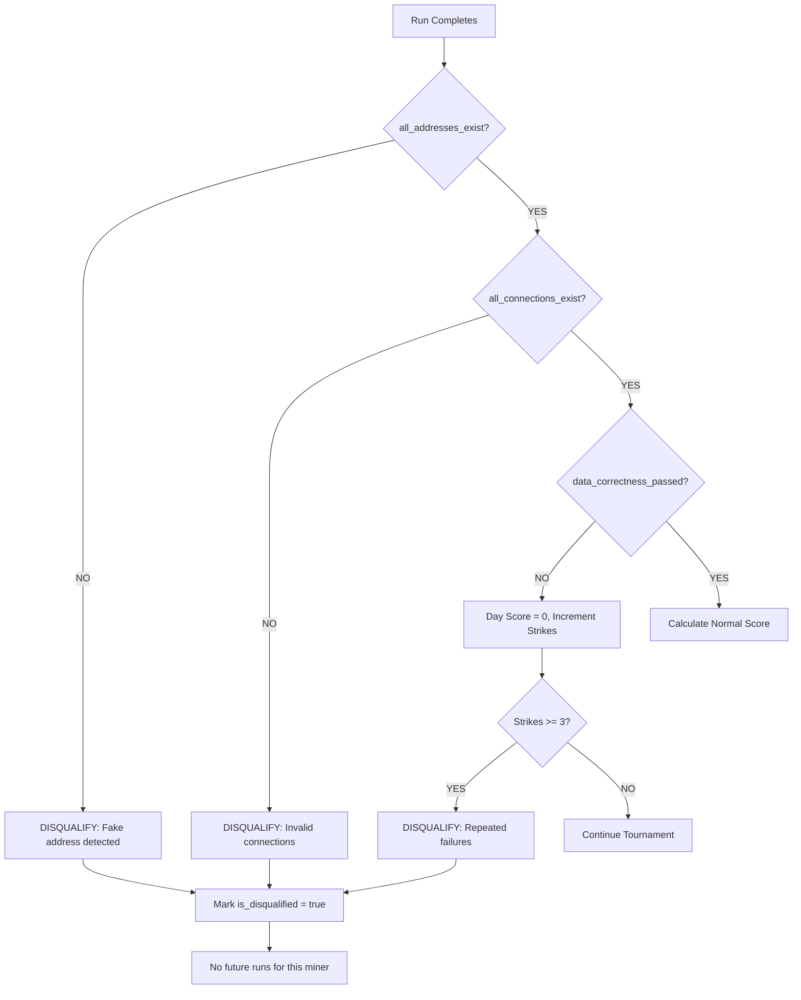

# Tournament API Design

This document details the unified schema design and REST API specification for tournament data access.

## 1. Unified Schema Design

### Key Insight
The original `benchmark_*` tables and new `tournament_*` tables represent the same underlying concept. We unify them by extending the existing `benchmark_*` tables with tournament-specific columns.

### Schema Changes

#### Tables to KEEP (with modifications)

```mermaid
erDiagram
    tournament_tournaments ||--|{ benchmark_epochs : "contains"
    tournament_tournaments ||--|{ tournament_participants : "has"
    tournament_tournaments ||--|{ tournament_results : "produces"
    baseline_registry ||--o{ tournament_tournaments : "provides baseline"
    benchmark_epochs ||--|{ benchmark_analytics_daily_runs : "contains"
    benchmark_epochs ||--|{ benchmark_ml_daily_runs : "contains"
    
    tournament_tournaments {
        uuid tournament_id PK
        string name
        enum image_type
        date registration_start
        date registration_end
        date competition_start
        date competition_end
        int max_participants
        int epoch_days
        array test_networks
        array test_window_days
        uuid baseline_id FK
        enum status
        int current_day
        string winner_hotkey
        bool baseline_beaten
        datetime created_at
        datetime completed_at
    }
    
    tournament_participants {
        uuid tournament_id PK_FK
        string hotkey PK
        enum participant_type
        datetime registered_at
        int registration_order
        string github_repository
        string docker_image_tag
        string miner_database_name
        uuid baseline_id
        enum status
        bool is_disqualified "NEW"
        string disqualification_reason "NEW"
        int disqualified_on_day "NEW"
    }
    
    tournament_results {
        uuid tournament_id PK
        string hotkey PK
        enum participant_type
        float pattern_accuracy_score
        float data_correctness_score
        float performance_score
        float final_score
        bool data_correctness_all_days
        bool all_runs_within_time_limit
        int days_completed
        int total_runs_completed
        float average_execution_time
        float baseline_comparison_ratio
        int rank
        bool is_winner
        bool beat_baseline
        int miners_beaten
        datetime calculated_at
    }
    
    baseline_registry {
        uuid baseline_id PK
        enum image_type
        string version
        string github_repository
        string docker_image_tag
        string source_hotkey
        uuid source_tournament_id
        enum status
        datetime created_at
        datetime deprecated_at
    }
    
    benchmark_epochs {
        uuid epoch_id PK
        uuid tournament_id FK "ADDED"
        string hotkey
        enum image_type
        date start_date
        date end_date
        enum status
        string docker_image_tag
        string miner_database_name
        datetime created_at
        datetime completed_at
    }
    
    benchmark_analytics_daily_runs {
        uuid run_id PK
        uuid epoch_id FK
        uuid tournament_id FK "ADDED"
        string hotkey
        enum participant_type "ADDED"
        int run_order "ADDED"
        date test_date
        string network
        int window_days
        date processing_date
        float execution_time_seconds
        int container_exit_code
        float gpu_memory_peak_mb
        int synthetic_patterns_expected
        int synthetic_patterns_found
        float synthetic_patterns_recall
        int novelty_patterns_reported
        int novelty_patterns_validated
        bool novelty_addresses_valid
        bool novelty_connections_valid
        bool all_addresses_exist
        bool all_connections_exist
        bool data_correctness_passed
        bool is_disqualified "ADDED"
        string disqualification_reason "ADDED"
        enum status
        string error_message
        datetime created_at
    }
```

#### Tables to REMOVE (redundant)

| Table | Reason |
|-------|--------|
| `tournament_epochs` | Use `benchmark_epochs` with `tournament_id` |
| `tournament_daily_runs` | Use `benchmark_analytics_daily_runs` with `tournament_id` |

### SQL Changes Required

#### 1. Modify `benchmark_epochs`

```sql
-- Add tournament_id column
ALTER TABLE benchmark_epochs ADD COLUMN IF NOT EXISTS tournament_id Nullable(UUID);
ALTER TABLE benchmark_epochs ADD INDEX IF NOT EXISTS idx_tournament_id tournament_id TYPE bloom_filter(0.01) GRANULARITY 4;
```

#### 2. Modify `benchmark_analytics_daily_runs`

```sql
-- Add tournament tracking columns
ALTER TABLE benchmark_analytics_daily_runs ADD COLUMN IF NOT EXISTS tournament_id Nullable(UUID);
ALTER TABLE benchmark_analytics_daily_runs ADD COLUMN IF NOT EXISTS participant_type Enum('miner', 'baseline') DEFAULT 'miner';
ALTER TABLE benchmark_analytics_daily_runs ADD COLUMN IF NOT EXISTS run_order UInt16 DEFAULT 0;
ALTER TABLE benchmark_analytics_daily_runs ADD COLUMN IF NOT EXISTS is_disqualified Bool DEFAULT false;
ALTER TABLE benchmark_analytics_daily_runs ADD COLUMN IF NOT EXISTS disqualification_reason Nullable(String);

-- Add indexes
ALTER TABLE benchmark_analytics_daily_runs ADD INDEX IF NOT EXISTS idx_tournament_id tournament_id TYPE bloom_filter(0.01) GRANULARITY 4;
ALTER TABLE benchmark_analytics_daily_runs ADD INDEX IF NOT EXISTS idx_participant_type participant_type TYPE set(0) GRANULARITY 4;
ALTER TABLE benchmark_analytics_daily_runs ADD INDEX IF NOT EXISTS idx_run_order run_order TYPE minmax GRANULARITY 4;
```

#### 3. Modify `benchmark_ml_daily_runs`

```sql
-- Same changes as analytics
ALTER TABLE benchmark_ml_daily_runs ADD COLUMN IF NOT EXISTS tournament_id Nullable(UUID);
ALTER TABLE benchmark_ml_daily_runs ADD COLUMN IF NOT EXISTS participant_type Enum('miner', 'baseline') DEFAULT 'miner';
ALTER TABLE benchmark_ml_daily_runs ADD COLUMN IF NOT EXISTS run_order UInt16 DEFAULT 0;
ALTER TABLE benchmark_ml_daily_runs ADD COLUMN IF NOT EXISTS is_disqualified Bool DEFAULT false;
ALTER TABLE benchmark_ml_daily_runs ADD COLUMN IF NOT EXISTS disqualification_reason Nullable(String);
```

#### 4. Modify `tournament_participants`

```sql
-- Add disqualification tracking
ALTER TABLE tournament_participants ADD COLUMN IF NOT EXISTS is_disqualified Bool DEFAULT false;
ALTER TABLE tournament_participants ADD COLUMN IF NOT EXISTS disqualification_reason Nullable(String);
ALTER TABLE tournament_participants ADD COLUMN IF NOT EXISTS disqualified_on_day Nullable(UInt8);
```

---

## 2. Disqualification Logic

### Disqualification Triggers

| Condition | Detection Point | Consequence |
|-----------|-----------------|-------------|
| Non-existent address in output | `all_addresses_exist = false` | Immediate disqualification |
| Invalid connection data | `all_connections_exist = false` | Immediate disqualification |
| Incorrect features | `data_correctness_passed = false` | Score = 0 for that day (3 strikes = disqualification) |
| Timeout | `status = 'timeout'` | Score = 0 for that day |
| Container crash | `container_exit_code != 0` | Score = 0 for that day |

### Disqualification Flow



### Edge Case: All Miners Disqualified

```python
# In TournamentScoringTask
if all(p.is_disqualified for p in participants if p.participant_type == 'miner'):
    # All miners disqualified - baseline wins by default
    tournament.winner_hotkey = None  # No winner
    tournament.baseline_beaten = False
    tournament.status = TournamentStatus.COMPLETED
    # Log: "Tournament completed with no valid participants"
```

---

## 3. REST API Specification

### Base URL
```
/api/v1/tournaments
```

### 3.1 List Tournaments (Historical)

**Endpoint:** `GET /api/v1/tournaments`

**Query Parameters:**
| Parameter | Type | Required | Description |
|-----------|------|----------|-------------|
| `image_type` | string | No | Filter by `analytics` or `ml` |
| `status` | string | No | Filter by status (`completed`, `in_progress`, etc.) |
| `limit` | int | No | Max results (default: 20, max: 100) |
| `offset` | int | No | Pagination offset |

**Response:**
```json
{
  "tournaments": [
    {
      "tournament_id": "550e8400-e29b-41d4-a716-446655440000",
      "name": "Analytics Tournament Q1 2025",
      "image_type": "analytics",
      "status": "completed",
      "competition_start": "2025-01-06",
      "competition_end": "2025-01-12",
      "participant_count": 8,
      "winner": {
        "hotkey": "5FHneW46xGXgs5mUiveU4sbTyGBzmstUspZC92UhjJM694ty",
        "beat_baseline": true
      },
      "created_at": "2025-01-01T10:00:00Z",
      "completed_at": "2025-01-12T23:59:59Z"
    },
    {
      "tournament_id": "550e8400-e29b-41d4-a716-446655440001",
      "name": "ML Tournament Q1 2025",
      "image_type": "ml",
      "status": "in_progress",
      "competition_start": "2025-01-13",
      "competition_end": "2025-01-19",
      "participant_count": 5,
      "winner": null,
      "created_at": "2025-01-08T10:00:00Z",
      "completed_at": null
    }
  ],
  "pagination": {
    "total": 42,
    "limit": 20,
    "offset": 0,
    "has_more": true
  }
}
```

---

### 3.2 Tournament Details

**Endpoint:** `GET /api/v1/tournaments/{tournament_id}`

**Response:**
```json
{
  "tournament_id": "550e8400-e29b-41d4-a716-446655440000",
  "name": "Analytics Tournament Q1 2025",
  "image_type": "analytics",
  "status": "completed",
  
  "schedule": {
    "registration_start": "2025-01-01",
    "registration_end": "2025-01-05",
    "competition_start": "2025-01-06",
    "competition_end": "2025-01-12"
  },
  
  "configuration": {
    "max_participants": 10,
    "epoch_days": 7,
    "test_networks": ["bittensor", "bitcoin", "zcash"],
    "test_window_days": [30, 90]
  },
  
  "baseline": {
    "baseline_id": "660e8400-e29b-41d4-a716-446655440099",
    "version": "v2.3.1",
    "hotkey": "baseline-chainswarm",
    "source_tournament_id": "440e8400-e29b-41d4-a716-446655440088"
  },
  
  "participants": {
    "total": 8,
    "active": 6,
    "disqualified": 2
  },
  
  "results": {
    "winner_hotkey": "5FHneW46xGXgs5mUiveU4sbTyGBzmstUspZC92UhjJM694ty",
    "baseline_beaten": true,
    "current_day": 7,
    "days_completed": 7
  },
  
  "created_at": "2025-01-01T10:00:00Z",
  "completed_at": "2025-01-12T23:59:59Z"
}
```

---

### 3.3 Tournament Leaderboard

**Endpoint:** `GET /api/v1/tournaments/{tournament_id}/leaderboard`

**Response:**
```json
{
  "tournament_id": "550e8400-e29b-41d4-a716-446655440000",
  "status": "completed",
  "leaderboard": [
    {
      "rank": 1,
      "hotkey": "5FHneW46xGXgs5mUiveU4sbTyGBzmstUspZC92UhjJM694ty",
      "participant_type": "miner",
      "is_winner": true,
      "is_disqualified": false,
      "scores": {
        "final_score": 0.892,
        "pattern_accuracy_score": 0.95,
        "data_correctness_score": 0.82,
        "performance_score": 0.85
      },
      "stats": {
        "days_completed": 7,
        "total_runs_completed": 14,
        "average_execution_time_seconds": 45.2,
        "baseline_comparison_ratio": 1.15,
        "beat_baseline": true,
        "miners_beaten": 5
      }
    },
    {
      "rank": 2,
      "hotkey": "baseline-chainswarm",
      "participant_type": "baseline",
      "is_winner": false,
      "is_disqualified": false,
      "scores": {
        "final_score": 0.776,
        "pattern_accuracy_score": 0.80,
        "data_correctness_score": 0.75,
        "performance_score": 0.78
      },
      "stats": {
        "days_completed": 7,
        "total_runs_completed": 14,
        "average_execution_time_seconds": 52.1,
        "baseline_comparison_ratio": 1.0,
        "beat_baseline": false,
        "miners_beaten": 0
      }
    },
    {
      "rank": 3,
      "hotkey": "5GrwvaEF5zXb26Fz9rcQpDWS57CtERHpNehXCPcNoHGKutQY",
      "participant_type": "miner",
      "is_winner": false,
      "is_disqualified": true,
      "disqualification_reason": "fake_address_detected",
      "disqualified_on_day": 3,
      "scores": {
        "final_score": 0.0,
        "pattern_accuracy_score": 0.0,
        "data_correctness_score": 0.0,
        "performance_score": 0.0
      },
      "stats": {
        "days_completed": 2,
        "total_runs_completed": 4,
        "average_execution_time_seconds": 38.5,
        "baseline_comparison_ratio": 0.0,
        "beat_baseline": false,
        "miners_beaten": 0
      }
    }
  ]
}
```

---

### 3.4 Tournament Daily Details

**Endpoint:** `GET /api/v1/tournaments/{tournament_id}/days/{day_number}`

**Response:**
```json
{
  "tournament_id": "550e8400-e29b-41d4-a716-446655440000",
  "day_number": 3,
  "test_date": "2025-01-08",
  
  "dataset": {
    "networks_tested": ["bittensor", "bitcoin"],
    "window_days_tested": [30, 90],
    "total_runs": 4
  },
  
  "runs": [
    {
      "run_order": 0,
      "participant_type": "baseline",
      "hotkey": "baseline-chainswarm",
      "status": "completed",
      
      "network_runs": [
        {
          "network": "bittensor",
          "window_days": 30,
          "run_id": "770e8400-e29b-41d4-a716-446655440111",
          
          "synthetic_patterns": {
            "expected": 150,
            "found": 142,
            "recall": 0.947
          },
          
          "novelty_patterns": {
            "reported": 23,
            "validated": 21,
            "addresses_valid": true,
            "connections_valid": true
          },
          
          "data_validation": {
            "all_addresses_exist": true,
            "all_connections_exist": true,
            "data_correctness_passed": true
          },
          
          "performance": {
            "execution_time_seconds": 48.3,
            "container_exit_code": 0,
            "gpu_memory_peak_mb": 4200.5
          },
          
          "status": "completed",
          "started_at": "2025-01-08T10:00:00Z",
          "completed_at": "2025-01-08T10:00:48Z"
        },
        {
          "network": "bitcoin",
          "window_days": 90,
          "run_id": "770e8400-e29b-41d4-a716-446655440112",
          "...": "..."
        }
      ]
    },
    {
      "run_order": 1,
      "participant_type": "miner",
      "hotkey": "5FHneW46xGXgs5mUiveU4sbTyGBzmstUspZC92UhjJM694ty",
      "status": "completed",
      
      "network_runs": [
        {
          "network": "bittensor",
          "window_days": 30,
          "run_id": "770e8400-e29b-41d4-a716-446655440211",
          
          "synthetic_patterns": {
            "expected": 150,
            "found": 148,
            "recall": 0.987
          },
          
          "novelty_patterns": {
            "reported": 31,
            "validated": 28,
            "addresses_valid": true,
            "connections_valid": true
          },
          
          "data_validation": {
            "all_addresses_exist": true,
            "all_connections_exist": true,
            "data_correctness_passed": true
          },
          
          "performance": {
            "execution_time_seconds": 42.1,
            "container_exit_code": 0,
            "gpu_memory_peak_mb": 3800.2
          },
          
          "baseline_comparison": {
            "synthetic_recall_vs_baseline": 1.042,
            "novelty_vs_baseline": 1.333,
            "execution_time_vs_baseline": 0.872
          },
          
          "status": "completed",
          "started_at": "2025-01-08T10:05:00Z",
          "completed_at": "2025-01-08T10:05:42Z"
        }
      ]
    },
    {
      "run_order": 2,
      "participant_type": "miner",
      "hotkey": "5GrwvaEF5zXb26Fz9rcQpDWS57CtERHpNehXCPcNoHGKutQY",
      "status": "disqualified",
      
      "network_runs": [
        {
          "network": "bittensor",
          "window_days": 30,
          "run_id": "770e8400-e29b-41d4-a716-446655440311",
          
          "data_validation": {
            "all_addresses_exist": false,
            "all_connections_exist": true,
            "data_correctness_passed": false
          },
          
          "disqualification": {
            "is_disqualified": true,
            "reason": "fake_address_detected",
            "message": "Address 5GrwvaEF... does not exist on chain"
          },
          
          "status": "completed",
          "started_at": "2025-01-08T10:10:00Z",
          "completed_at": "2025-01-08T10:10:35Z"
        }
      ]
    }
  ]
}
```

---

### 3.5 Participant History

**Endpoint:** `GET /api/v1/tournaments/{tournament_id}/participants/{hotkey}`

**Response:**
```json
{
  "tournament_id": "550e8400-e29b-41d4-a716-446655440000",
  "hotkey": "5FHneW46xGXgs5mUiveU4sbTyGBzmstUspZC92UhjJM694ty",
  "participant_type": "miner",
  
  "registration": {
    "registered_at": "2025-01-02T15:30:00Z",
    "registration_order": 3,
    "github_repository": "https://github.com/miner123/analytics-solution",
    "docker_image_tag": "miner123/analytics:v1.2.3"
  },
  
  "status": {
    "current_status": "active",
    "is_disqualified": false,
    "disqualification_reason": null
  },
  
  "result": {
    "rank": 1,
    "is_winner": true,
    "final_score": 0.892,
    "beat_baseline": true,
    "miners_beaten": 5
  },
  
  "daily_performance": [
    {
      "day_number": 1,
      "test_date": "2025-01-06",
      "networks": {
        "bittensor": {
          "synthetic_recall": 0.92,
          "novelty_validated": 18,
          "execution_time_seconds": 44.2,
          "data_correctness_passed": true
        },
        "bitcoin": {
          "synthetic_recall": 0.89,
          "novelty_validated": 12,
          "execution_time_seconds": 51.3,
          "data_correctness_passed": true
        }
      },
      "day_score": 0.87
    },
    {
      "day_number": 2,
      "test_date": "2025-01-07",
      "networks": {
        "bittensor": {
          "synthetic_recall": 0.95,
          "novelty_validated": 22,
          "execution_time_seconds": 41.8,
          "data_correctness_passed": true
        },
        "bitcoin": {
          "synthetic_recall": 0.91,
          "novelty_validated": 15,
          "execution_time_seconds": 48.7,
          "data_correctness_passed": true
        }
      },
      "day_score": 0.91
    }
  ]
}
```

---

## 4. Summary of Changes

### Files to Modify

| File | Changes |
|------|---------|
| `packages/storage/schema/benchmark_epochs.sql` | Add `tournament_id` column |
| `packages/storage/schema/benchmark_analytics_daily_runs.sql` | Add `tournament_id`, `participant_type`, `run_order`, disqualification columns |
| `packages/storage/schema/benchmark_ml_daily_runs.sql` | Same as analytics |
| `packages/storage/schema/tournament_participants.sql` | Add disqualification columns |
| `packages/benchmark/models/miner.py` | Add disqualification fields |
| `packages/storage/repositories/tournament_repository.py` | Update to use `benchmark_*` tables |

### Files to Remove

| File | Reason |
|------|--------|
| `packages/storage/schema/tournament_epochs.sql` | Redundant |
| `packages/storage/schema/tournament_daily_runs.sql` | Redundant |

### New Files to Create

| File | Purpose |
|------|---------|
| `packages/api/routers/tournament_router.py` | FastAPI router for tournament endpoints |
| `packages/api/models/tournament_responses.py` | Pydantic response models |
| `packages/api/services/tournament_service.py` | Service layer for data aggregation |

---

## 5. Implementation Order

1. **Schema Migration** - Add columns to `benchmark_*` tables
2. **Remove Redundant Tables** - Delete `tournament_epochs`, `tournament_daily_runs`
3. **Update Repository** - Modify `TournamentRepository` to query unified tables
4. **Create API Layer** - FastAPI router + Pydantic models
5. **Test Endpoints** - Validate JSON responses