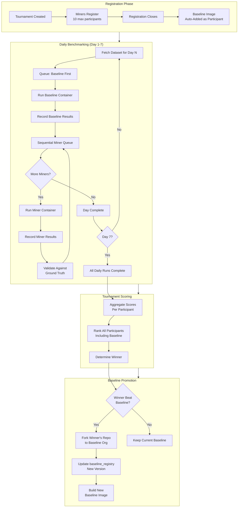
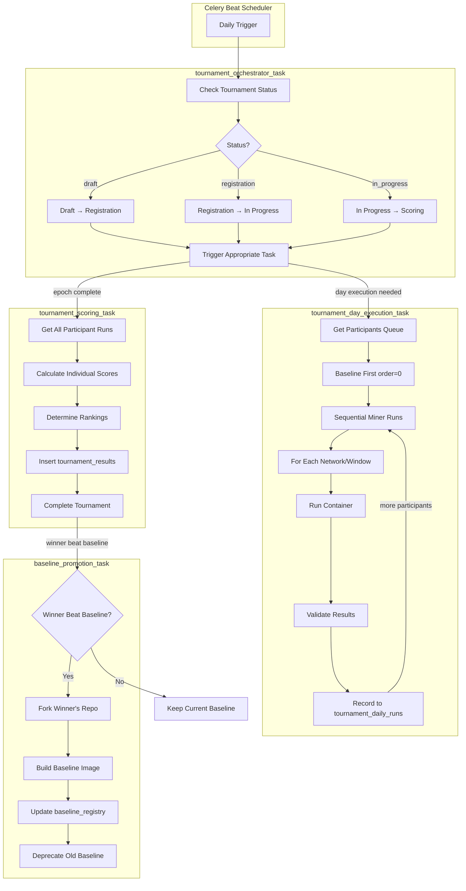
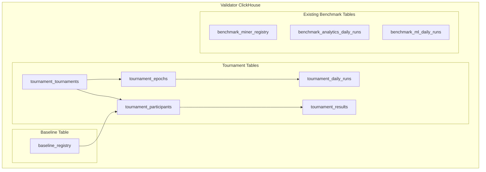
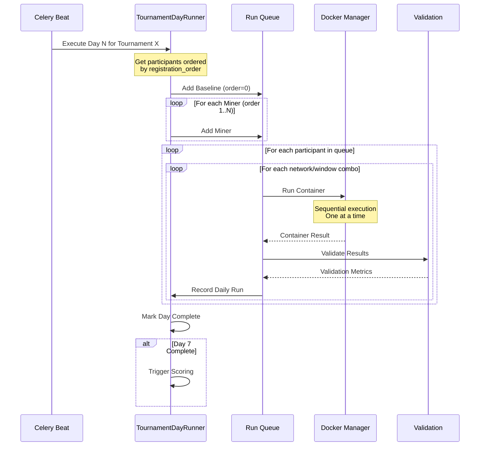
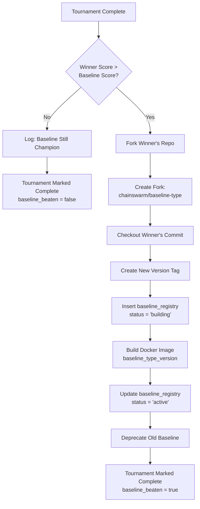
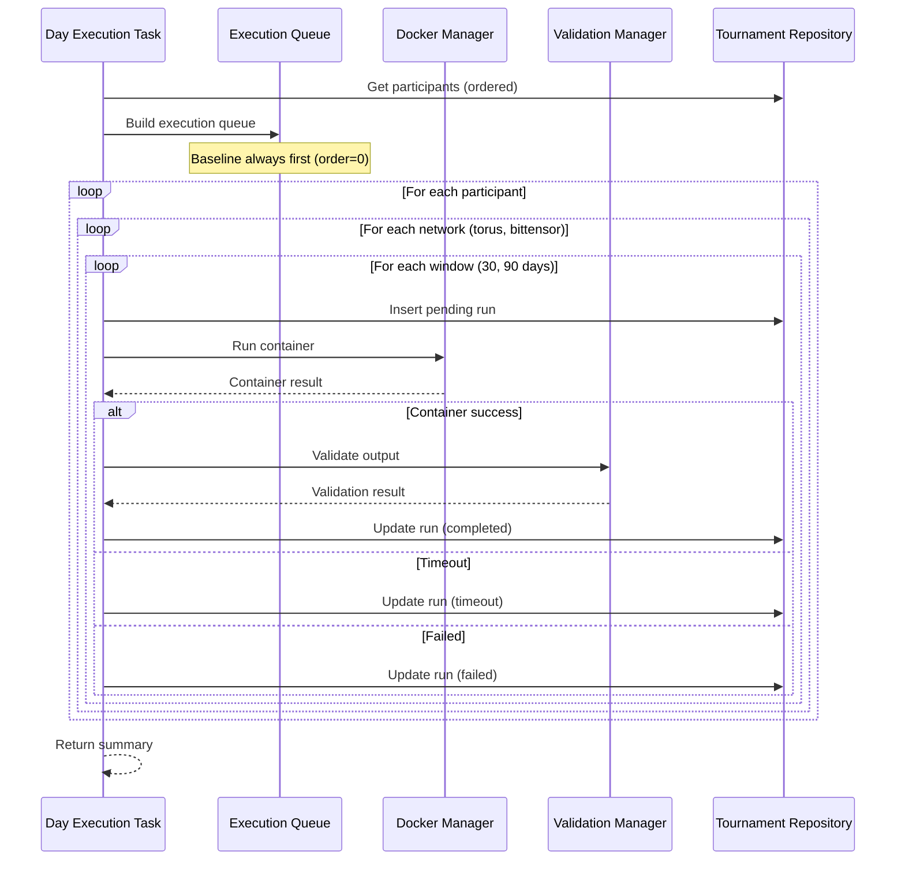
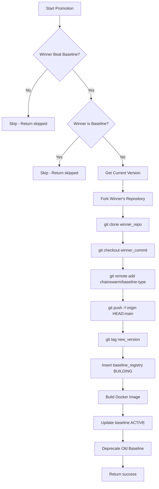

# Tournament Benchmark System - Architecture Design

## Overview

This document describes the tournament-based benchmark system where miners compete in synchronized 7-day epochs. Winners can become the new baseline that future miners must beat.

---

## Implementation Summary

The tournament system is fully implemented with the following components:

| Layer | Files | Description |
|-------|-------|-------------|
| **Schema** | 6 SQL files | ClickHouse tables for tournament data |
| **Models** | 2 Python files | Dataclasses and enums for type safety |
| **Repositories** | 2 Python files | Database access layer |
| **Managers** | 2 Python files | Business logic for tournaments and baselines |
| **Celery Tasks** | 4 Python files | Async task orchestration |

---

## High-Level Tournament Flow



---

## Complete Task Flow Architecture

### Celery Task Pipeline



---

## Key Design Decisions

1. **Sequential Execution** - Miners benchmarked one-by-one within each day in registration order
2. **Day Precision** - All participants share the same test date, but run at different times during that day
3. **Baseline as Participant** - Baseline always runs first (order=0) and is compared directly against miners
4. **No Brackets** - Simple score comparison; highest final score wins
5. **Baseline Promotion** - Tournament winner's code is forked to become the new baseline

---

## Database Architecture



---

## Schema (ClickHouse)

### 1. Baseline Registry Table

Manages the official baseline images (the code miners must beat).

```sql
CREATE TABLE IF NOT EXISTS baseline_registry (
    baseline_id UUID DEFAULT generateUUIDv4(),
    image_type Enum('analytics', 'ml'),
    
    -- Version tracking
    version String,  -- e.g., "v1.0.0", "v1.1.0"
    
    -- Source code location
    github_repository String,  -- Fork location: "chainswarm/baseline-analytics"
    commit_hash String,        -- Pinned commit
    
    -- Docker image
    docker_image_tag String,   -- e.g., "baseline_analytics_v1.0.0"
    
    -- Origin tracking (who created this baseline)
    originated_from_tournament_id Nullable(UUID),  -- Tournament where winner was crowned
    originated_from_hotkey Nullable(String),       -- Original miner hotkey
    
    -- Status
    status Enum('building', 'active', 'deprecated') DEFAULT 'building',
    
    -- Timestamps
    created_at DateTime DEFAULT now(),
    activated_at Nullable(DateTime),
    deprecated_at Nullable(DateTime)
) ENGINE = ReplacingMergeTree(created_at)
ORDER BY (image_type, version);

ALTER TABLE baseline_registry ADD INDEX IF NOT EXISTS idx_baseline_id baseline_id TYPE bloom_filter(0.01) GRANULARITY 4;
ALTER TABLE baseline_registry ADD INDEX IF NOT EXISTS idx_status status TYPE set(0) GRANULARITY 4;
ALTER TABLE baseline_registry ADD INDEX IF NOT EXISTS idx_image_type image_type TYPE set(0) GRANULARITY 4;
```

### 2. Tournament Tournaments Table

Main tournament definition.

```sql
CREATE TABLE IF NOT EXISTS tournament_tournaments (
    tournament_id UUID DEFAULT generateUUIDv4(),
    
    -- Identity
    name String,
    image_type Enum('analytics', 'ml'),
    
    -- Time boundaries (day precision)
    registration_start Date,
    registration_end Date,
    competition_start Date,  -- First benchmark day
    competition_end Date,    -- Last benchmark day (start + epoch_days - 1)
    
    -- Configuration
    max_participants UInt16 DEFAULT 10,
    epoch_days UInt8 DEFAULT 7,
    
    -- Test configuration
    test_networks Array(String) DEFAULT ['torus', 'bittensor'],
    test_window_days Array(UInt16) DEFAULT [30, 90],
    
    -- Baseline for this tournament
    baseline_id UUID,  -- Active baseline at tournament creation
    
    -- Status tracking
    status Enum('draft', 'registration', 'in_progress', 'scoring', 'completed', 'cancelled') DEFAULT 'draft',
    current_day UInt8 DEFAULT 0,  -- Which day of competition (1-7)
    
    -- Results
    winner_hotkey Nullable(String),
    baseline_beaten Bool DEFAULT false,
    
    created_at DateTime DEFAULT now(),
    completed_at Nullable(DateTime)
) ENGINE = ReplacingMergeTree(created_at)
ORDER BY (tournament_id);

ALTER TABLE tournament_tournaments ADD INDEX IF NOT EXISTS idx_status status TYPE set(0) GRANULARITY 4;
ALTER TABLE tournament_tournaments ADD INDEX IF NOT EXISTS idx_image_type image_type TYPE set(0) GRANULARITY 4;
ALTER TABLE tournament_tournaments ADD INDEX IF NOT EXISTS idx_competition_start competition_start TYPE minmax GRANULARITY 4;
```

### 3. Tournament Participants Table

Participants including baseline as a special participant.

```sql
CREATE TABLE IF NOT EXISTS tournament_participants (
    tournament_id UUID,
    
    -- Participant identity
    hotkey String,  -- For baseline: "baseline_{version}"
    participant_type Enum('miner', 'baseline') DEFAULT 'miner',
    
    -- Registration
    registered_at DateTime DEFAULT now(),
    registration_order UInt16,  -- Order determines benchmark sequence (baseline = 0)
    
    -- Source (for miners: links to miner_registry; for baseline: links to baseline_registry)
    github_repository String,
    docker_image_tag String,
    miner_database_name String,
    
    -- For baseline participants
    baseline_id Nullable(UUID),
    
    -- Status
    status Enum('registered', 'active', 'completed', 'failed', 'disqualified') DEFAULT 'registered',
    
    updated_at DateTime DEFAULT now()
) ENGINE = ReplacingMergeTree(updated_at)
ORDER BY (tournament_id, registration_order);

ALTER TABLE tournament_participants ADD INDEX IF NOT EXISTS idx_hotkey hotkey TYPE bloom_filter(0.01) GRANULARITY 4;
ALTER TABLE tournament_participants ADD INDEX IF NOT EXISTS idx_participant_type participant_type TYPE set(0) GRANULARITY 4;
ALTER TABLE tournament_participants ADD INDEX IF NOT EXISTS idx_status status TYPE set(0) GRANULARITY 4;
```

### 4. Tournament Epochs Table

Shared epoch for all participants in a tournament.

```sql
CREATE TABLE IF NOT EXISTS tournament_epochs (
    epoch_id UUID DEFAULT generateUUIDv4(),
    tournament_id UUID,
    
    -- Day precision
    start_date Date,  -- = competition_start from tournament
    end_date Date,    -- = competition_end from tournament
    
    -- Status
    status Enum('pending', 'running', 'completed', 'failed') DEFAULT 'pending',
    
    created_at DateTime DEFAULT now(),
    completed_at Nullable(DateTime)
) ENGINE = MergeTree()
ORDER BY (tournament_id, start_date);

ALTER TABLE tournament_epochs ADD INDEX IF NOT EXISTS idx_epoch_id epoch_id TYPE bloom_filter(0.01) GRANULARITY 4;
ALTER TABLE tournament_epochs ADD INDEX IF NOT EXISTS idx_status status TYPE set(0) GRANULARITY 4;
```

### 5. Tournament Daily Runs Table

Daily run results for each participant.

```sql
CREATE TABLE IF NOT EXISTS tournament_daily_runs (
    tournament_id UUID,
    epoch_id UUID,
    hotkey String,
    participant_type Enum('miner', 'baseline'),
    
    -- Day tracking
    test_date Date,
    run_order UInt16,  -- Order executed on this day (baseline = 0)
    
    -- Network/window configuration
    network String,
    window_days UInt16,
    
    -- Link to actual run record
    run_id UUID,  -- References benchmark_analytics_daily_runs or benchmark_ml_daily_runs
    
    -- Quick access metrics (denormalized from daily_runs)
    execution_time_seconds Float64,
    pattern_accuracy Float64,  -- synthetic_patterns_recall (analytics) or auc_roc (ml)
    data_correctness_passed Bool,
    
    -- Execution timing
    started_at DateTime,
    completed_at Nullable(DateTime),
    
    status Enum('pending', 'running', 'completed', 'failed', 'timeout') DEFAULT 'pending'
) ENGINE = MergeTree()
ORDER BY (tournament_id, test_date, run_order);

ALTER TABLE tournament_daily_runs ADD INDEX IF NOT EXISTS idx_epoch_id epoch_id TYPE bloom_filter(0.01) GRANULARITY 4;
ALTER TABLE tournament_daily_runs ADD INDEX IF NOT EXISTS idx_hotkey hotkey TYPE bloom_filter(0.01) GRANULARITY 4;
ALTER TABLE tournament_daily_runs ADD INDEX IF NOT EXISTS idx_test_date test_date TYPE minmax GRANULARITY 4;
ALTER TABLE tournament_daily_runs ADD INDEX IF NOT EXISTS idx_run_id run_id TYPE bloom_filter(0.01) GRANULARITY 4;
```

### 6. Tournament Results Table

Final aggregated results per participant (includes baseline performance tracking).

```sql
CREATE TABLE IF NOT EXISTS tournament_results (
    tournament_id UUID,
    hotkey String,
    participant_type Enum('miner', 'baseline'),
    
    -- Aggregated scores (from all days across all network/window combos)
    pattern_accuracy_score Float64,
    data_correctness_score Float64,
    performance_score Float64,
    final_score Float64,
    
    -- Validation status
    data_correctness_all_days Bool,
    all_runs_within_time_limit Bool,
    days_completed UInt8,
    total_runs_completed UInt16,  -- days * networks * windows
    
    -- Performance metrics
    average_execution_time_seconds Float64,
    baseline_comparison_ratio Float64,  -- Miner time / Baseline time for this tournament
    
    -- Ranking
    rank UInt16,
    is_winner Bool DEFAULT false,
    beat_baseline Bool DEFAULT false,  -- Scored higher than baseline in this tournament
    
    -- For baseline: tracks how it performed relative to miners
    miners_beaten UInt16 DEFAULT 0,     -- How many miners this participant beat
    
    calculated_at DateTime DEFAULT now()
) ENGINE = ReplacingMergeTree(calculated_at)
ORDER BY (tournament_id, rank);

ALTER TABLE tournament_results ADD INDEX IF NOT EXISTS idx_hotkey hotkey TYPE bloom_filter(0.01) GRANULARITY 4;
ALTER TABLE tournament_results ADD INDEX IF NOT EXISTS idx_final_score final_score TYPE minmax GRANULARITY 4;
ALTER TABLE tournament_results ADD INDEX IF NOT EXISTS idx_is_winner is_winner TYPE set(0) GRANULARITY 4;
ALTER TABLE tournament_results ADD INDEX IF NOT EXISTS idx_participant_type participant_type TYPE set(0) GRANULARITY 4;
```

---

## Sequential Daily Execution Flow



---

## Baseline Promotion Flow



---

## Integration with Existing Tables

The tournament system reuses existing benchmark tables:

| New Table | References | Purpose |
|-----------|-----------|---------|
| `tournament_participants` | `benchmark_miner_registry` | Get miner GitHub repo, validate status |
| `tournament_daily_runs.run_id` | `benchmark_analytics_daily_runs` or `benchmark_ml_daily_runs` | Link to actual execution data |
| `tournament_participants.baseline_id` | `baseline_registry` | Link to active baseline |

---

## Scoring Formula

Same as existing benchmark scoring (from `ScoringManager`):

```python
PATTERN_ACCURACY_WEIGHT = 0.50
DATA_CORRECTNESS_WEIGHT = 0.30
PERFORMANCE_WEIGHT = 0.20

def calculate_final_score(runs: List[DailyRun], baseline_avg_time: float) -> float:
    # Disqualification checks
    if not all(run.data_correctness_passed for run in runs):
        return 0.0
    
    if not all(run.execution_time <= MAX_EXECUTION_TIME for run in runs):
        return 0.0
    
    # Score components
    pattern_accuracy_score = mean([run.pattern_accuracy for run in runs])
    data_correctness_score = 1.0  # All passed validation
    
    avg_time = mean([run.execution_time for run in runs])
    performance_ratio = baseline_avg_time / avg_time
    performance_score = min(performance_ratio, 1.0)
    
    final_score = (
        0.50 * pattern_accuracy_score +
        0.30 * data_correctness_score +
        0.20 * performance_score
    )
    
    return final_score
```

---

## New Package Structure

```
packages/
├── benchmark/
│   ├── managers/
│   │   ├── baseline_manager.py        # NEW: Baseline forking and management
│   │   ├── tournament_manager.py      # NEW: Tournament lifecycle
│   │   └── ... (existing managers)
│   └── models/
│       ├── baseline.py                # NEW: Baseline model
│       ├── tournament.py              # NEW: Tournament models
│       └── ... (existing models)
│
├── jobs/
│   └── tasks/
│       ├── tournament_orchestrator_task.py    # NEW: Main tournament orchestrator
│       ├── tournament_day_execution_task.py   # NEW: Daily sequential execution
│       ├── tournament_scoring_task.py         # NEW: Final scoring
│       ├── baseline_promotion_task.py         # NEW: Fork and promote winner
│       └── ... (existing tasks)
│
├── storage/
│   ├── repositories/
│   │   ├── baseline_repository.py             # NEW
│   │   ├── tournament_repository.py           # NEW
│   │   └── ... (existing repositories)
│   └── schema/
│       ├── baseline_registry.sql              # NEW
│       ├── tournament_tournaments.sql         # NEW
│       ├── tournament_participants.sql        # NEW
│       ├── tournament_epochs.sql              # NEW
│       ├── tournament_daily_runs.sql          # NEW
│       ├── tournament_results.sql             # NEW
│       └── ... (existing schemas)
```

---

## Configuration

```bash
# Baseline Configuration
BASELINE_GITHUB_ORG=chainswarm
BASELINE_ANALYTICS_REPO=baseline-analytics
BASELINE_ML_REPO=baseline-ml
GITHUB_TOKEN=xxx  # For forking repos

# Tournament Configuration
TOURNAMENT_MAX_PARTICIPANTS=10
TOURNAMENT_EPOCH_DAYS=7
TOURNAMENT_TEST_NETWORKS=torus,bittensor
TOURNAMENT_TEST_WINDOWS=30,90
```

---

## Table Summary

| Table | Purpose | Engine |
|-------|---------|--------|
| `baseline_registry` | Track official baseline images and versions | ReplacingMergeTree |
| `tournament_tournaments` | Tournament definitions and status | ReplacingMergeTree |
| `tournament_participants` | Miners + baseline registered per tournament | ReplacingMergeTree |
| `tournament_epochs` | Shared epoch per tournament | MergeTree |
| `tournament_daily_runs` | Daily run records per participant | MergeTree |
| `tournament_results` | Final aggregated scores and rankings | ReplacingMergeTree |

**Total: 6 new tables**

---

## Celery Task Implementations

### 1. Tournament Orchestrator Task

**File:** [`packages/jobs/tasks/tournament_orchestrator_task.py`](../packages/jobs/tasks/tournament_orchestrator_task.py)

**Purpose:** Main lifecycle manager that checks tournament status and triggers appropriate actions.

```python
# Key entry point
tournament_orchestrator_task(
    image_type: str,           # 'analytics' or 'ml'
    tournament_id: str = None, # Optional: process specific tournament
    test_date: str = None      # Optional: override current date
)
```

**State Transitions:**

| Current Status | Condition | Next Status | Action |
|---------------|-----------|-------------|--------|
| `draft` | `current_date >= registration_start` | `registration` | Open registration |
| `registration` | `current_date > registration_end` | `in_progress` | Create epoch, activate participants |
| `in_progress` | `current_date > competition_end` | `scoring` | Trigger scoring task |
| `scoring` | Results exist with winner | `completed` | Mark complete, trigger baseline promotion if needed |

**Triggered Tasks:**
- `tournament_day_execution_task` - When daily execution needed
- `tournament_scoring_task` - When epoch complete
- `baseline_promotion_task` - When winner beats baseline

---

### 2. Tournament Day Execution Task

**File:** [`packages/jobs/tasks/tournament_day_execution_task.py`](../packages/jobs/tasks/tournament_day_execution_task.py)

**Purpose:** Executes all participant benchmarks for a single day in sequential order.

```python
# Key entry point
tournament_day_execution_task(
    tournament_id: str,  # Tournament UUID
    image_type: str,     # 'analytics' or 'ml'
    test_date: str       # YYYY-MM-DD format
)
```

**Execution Flow:**



**Run Configuration:**
- **Networks:** `['torus', 'bittensor']` (from `tournament.test_networks`)
- **Windows:** `[30, 90]` days (from `tournament.test_window_days`)
- **Total runs per participant per day:** 4 (2 networks × 2 windows)

**Time Limits:**
- Task time limit: 4 hours (14400 seconds)
- Soft limit: ~3.9 hours (14000 seconds)

---

### 3. Tournament Scoring Task

**File:** [`packages/jobs/tasks/tournament_scoring_task.py`](../packages/jobs/tasks/tournament_scoring_task.py)

**Purpose:** Calculates final scores after all 7 days complete.

```python
# Key entry point
tournament_scoring_task(
    tournament_id: str,  # Tournament UUID
    image_type: str      # 'analytics' or 'ml'
)
```

**Scoring Algorithm:**

```python
# Weight constants (from TournamentManager)
PATTERN_ACCURACY_WEIGHT = 0.50
DATA_CORRECTNESS_WEIGHT = 0.30
PERFORMANCE_WEIGHT = 0.20

def calculate_final_score(runs, baseline_avg_time):
    # 1. Disqualification checks
    if not all(run.data_correctness_passed for run in runs):
        return 0.0
    
    if any(run.execution_time > MAX_EXECUTION_TIME for run in runs):
        return 0.0
    
    # 2. Calculate components
    pattern_accuracy = mean([r.pattern_accuracy for r in runs])
    data_correctness = 1.0  # All passed
    
    avg_time = mean([r.execution_time for r in runs])
    performance_ratio = baseline_avg_time / avg_time
    performance = min(performance_ratio, 1.0)
    
    # 3. Weighted final score
    return (
        0.50 * pattern_accuracy +
        0.30 * data_correctness +
        0.20 * performance
    )
```

**Ranking Process:**

1. Sort all participants by `final_score` (descending)
2. Assign `rank` (1 = winner)
3. Compare each score to baseline score
4. Set `beat_baseline = True` if score > baseline_score
5. Count `miners_beaten` for each participant

---

### 4. Baseline Promotion Task

**File:** [`packages/jobs/tasks/baseline_promotion_task.py`](../packages/jobs/tasks/baseline_promotion_task.py)

**Purpose:** Promotes tournament winner as new official baseline.

```python
# Key entry point
baseline_promotion_task(
    tournament_id: str,  # Tournament UUID
    image_type: str,     # 'analytics' or 'ml'
    winner_hotkey: str   # Winner's hotkey
)
```

**Promotion Flow:**



**Version Increment:**
```python
def get_next_version(current: str) -> str:
    # v1.0.0 → v1.1.0
    # v1.5.0 → v1.6.0
    major, minor, _ = current.lstrip('v').split('.')
    return f'v{major}.{int(minor) + 1}.0'
```

**GitHub Repository Targets:**
- Analytics baseline: `chainswarm/baseline-analytics`
- ML baseline: `chainswarm/baseline-ml`

---

## Manager Classes

### BaselineManager

**File:** [`packages/benchmark/managers/baseline_manager.py`](../packages/benchmark/managers/baseline_manager.py)

| Method | Purpose |
|--------|---------|
| `get_baseline_repo_name(image_type)` | Returns `baseline-analytics` or `baseline-ml` |
| `get_next_version(current_version)` | Increments semantic version |
| `fork_winner_as_baseline(...)` | Clones winner repo, pushes to baseline org |
| `build_baseline_image(baseline)` | Builds Docker image using DockerManager |
| `create_initial_baseline(...)` | Creates v1.0.0 baseline |
| `_run_git_command(args, cwd)` | Executes git commands |

### TournamentManager

**File:** [`packages/benchmark/managers/tournament_manager.py`](../packages/benchmark/managers/tournament_manager.py)

| Method | Purpose |
|--------|---------|
| `create_tournament(...)` | Creates new tournament with baseline |
| `create_baseline_participant(...)` | Adds baseline as participant (order=0) |
| `create_miner_participant(...)` | Adds miner participant |
| `create_tournament_epoch(...)` | Creates epoch for tournament |
| `get_execution_queue(participants)` | Returns participants sorted by order |
| `calculate_participant_score(...)` | Calculates final score from runs |
| `determine_rankings(results)` | Sorts results, assigns ranks |

---

## Repository Classes

### BaselineRepository

**File:** [`packages/storage/repositories/baseline_repository.py`](../packages/storage/repositories/baseline_repository.py)

| Method | SQL Table |
|--------|-----------|
| `get_active_baseline(image_type)` | `baseline_registry WHERE status='active'` |
| `get_baseline_by_id(baseline_id)` | `baseline_registry WHERE baseline_id=?` |
| `insert_baseline(baseline)` | `INSERT INTO baseline_registry` |
| `update_baseline_status(...)` | `UPDATE baseline_registry SET status=?` |
| `deprecate_baseline(baseline_id)` | Sets `status='deprecated', deprecated_at=now()` |

### TournamentRepository

**File:** [`packages/storage/repositories/tournament_repository.py`](../packages/storage/repositories/tournament_repository.py)

**Tournament Operations:**
- `get_tournament_by_id()`, `get_active_tournaments()`, `get_tournaments_by_status()`
- `insert_tournament()`, `update_tournament_status()`, `complete_tournament()`

**Participant Operations:**
- `get_participants()`, `get_participant()`, `get_next_registration_order()`
- `insert_participant()`, `update_participant_status()`

**Epoch Operations:**
- `get_tournament_epoch()`, `insert_epoch()`, `update_epoch_status()`

**Run Operations:**
- `get_daily_runs()`, `get_participant_runs()`, `insert_daily_run()`, `update_daily_run_status()`

**Result Operations:**
- `get_results()`, `get_result()`, `insert_result()`

---

## Environment Variables

```bash
# Baseline Configuration
BASELINE_GITHUB_ORG=chainswarm
BASELINE_ANALYTICS_REPO=baseline-analytics
BASELINE_ML_REPO=baseline-ml
GITHUB_TOKEN=xxx  # For repository forking

# Tournament Configuration
TOURNAMENT_MAX_PARTICIPANTS=10
TOURNAMENT_EPOCH_DAYS=7
TOURNAMENT_TEST_NETWORKS=torus,bittensor
TOURNAMENT_TEST_WINDOWS=30,90

# Benchmark Settings
BENCHMARK_MAX_EXECUTION_TIME=3600
BENCHMARK_REPOS_PATH=/var/benchmark/repos
BENCHMARK_DATA_PATH=/var/benchmark/data

# Database
DATABASE_PREFIX=benchmark
VALIDATOR_CH_HOST=localhost
VALIDATOR_CH_PORT=9000
```

---

## File Structure (Implemented)

```
packages/
├── benchmark/
│   ├── managers/
│   │   ├── baseline_manager.py      ✅ Created
│   │   ├── tournament_manager.py    ✅ Created
│   │   └── __init__.py              ✅ Updated
│   └── models/
│       ├── baseline.py              ✅ Created
│       ├── tournament.py            ✅ Created
│       └── __init__.py              ✅ Updated
│
├── jobs/
│   ├── base/
│   │   ├── task_models.py           ✅ Updated (TournamentTaskContext)
│   │   └── __init__.py              ✅ Updated
│   └── tasks/
│       ├── tournament_orchestrator_task.py   ✅ Created
│       ├── tournament_day_execution_task.py  ✅ Created
│       ├── tournament_scoring_task.py        ✅ Created
│       ├── baseline_promotion_task.py        ✅ Created
│       └── __init__.py                       ✅ Updated
│
└── storage/
    ├── repositories/
    │   ├── baseline_repository.py    ✅ Created
    │   ├── tournament_repository.py  ✅ Created
    │   └── __init__.py               ✅ Updated
    └── schema/
        ├── baseline_registry.sql           ✅ Created
        ├── tournament_tournaments.sql      ✅ Created
        ├── tournament_participants.sql     ✅ Created
        ├── tournament_epochs.sql           ✅ Created
        ├── tournament_daily_runs.sql       ✅ Created
        └── tournament_results.sql          ✅ Created
```