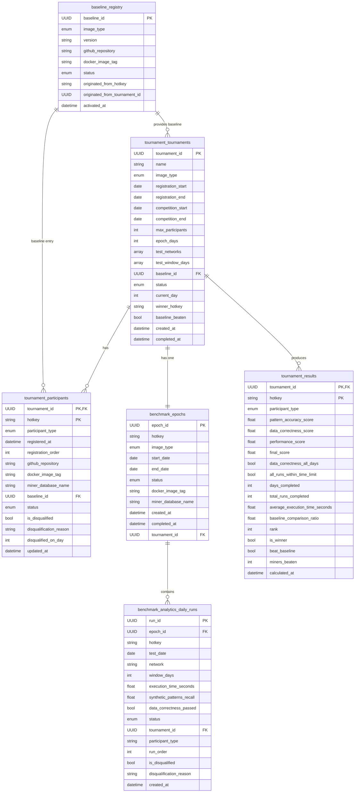
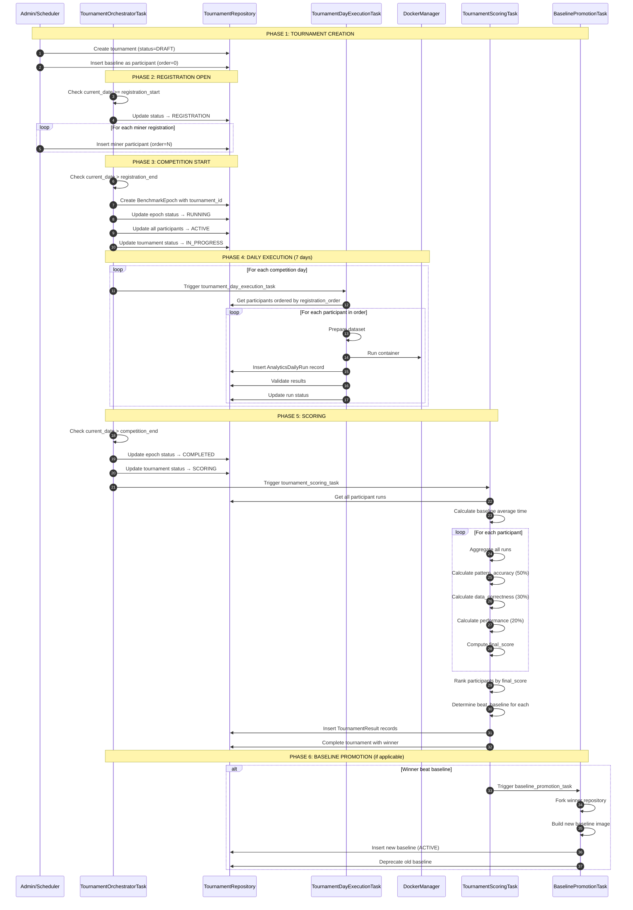

# Tournament System Flow Summary

## Overview

The tournament system enables **synchronized competition** between miners, running on the same data and evaluation criteria to determine who can beat the current baseline.

## Architecture

```
┌─────────────────────────────────────────────────────────────────────────────────┐
│                           TOURNAMENT LIFECYCLE                                   │
├─────────────────────────────────────────────────────────────────────────────────┤
│                                                                                  │
│   DRAFT → REGISTRATION → IN_PROGRESS → SCORING → COMPLETED                     │
│                                                                                  │
│   ┌─────────┐    ┌──────────────┐    ┌────────────────┐    ┌─────────────┐     │
│   │ Create  │───▶│ Accept Miner │───▶│ Execute Daily  │───▶│  Calculate  │     │
│   │ with    │    │ Registrations│    │ Benchmarks     │    │  Scores &   │     │
│   │ Baseline│    │              │    │                │    │  Rankings   │     │
│   └─────────┘    └──────────────┘    └────────────────┘    └─────────────┘     │
│                                                                │                 │
│                                             ┌──────────────────┴──────────────┐ │
│                                             ▼                                  │ │
│                                   ┌─────────────────┐                         │ │
│                                   │ Promote Winner  │─── If beat baseline     │ │
│                                   │ as New Baseline │                         │ │
│                                   └─────────────────┘                         │ │
│                                                                                  │
└─────────────────────────────────────────────────────────────────────────────────┘
```

## Database Schema

### Entity Relationship Diagram



## Execution Flow

### Tournament Lifecycle Sequence



## Task Descriptions

### 1. TournamentOrchestratorTask

**File:** [`packages/jobs/tasks/tournament_orchestrator_task.py`](../packages/jobs/tasks/tournament_orchestrator_task.py)

**Purpose:** Manages the tournament lifecycle by checking status and triggering appropriate actions.

**Status Transitions:**
| Current Status | Condition | Action | New Status |
|---------------|-----------|--------|------------|
| DRAFT | `current_date >= registration_start` | Open registration | REGISTRATION |
| REGISTRATION | `current_date > registration_end` | Create epoch, activate participants | IN_PROGRESS |
| IN_PROGRESS | `current_date > competition_end` | Complete epoch, trigger scoring | SCORING |
| SCORING | Results exist with winner | Complete tournament | COMPLETED |

### 2. TournamentDayExecutionTask

**File:** [`packages/jobs/tasks/tournament_day_execution_task.py`](../packages/jobs/tasks/tournament_day_execution_task.py)

**Purpose:** Executes daily benchmarks for all participants sequentially.

**Execution Order:**
1. Baseline (registration_order=0) runs first
2. Miners run in registration order (1, 2, 3, ...)
3. Each participant runs for every network/window combination

**Per-Run Operations:**
1. Fetch dataset
2. Run Docker container
3. Validate results
4. Record to `benchmark_analytics_daily_runs`

### 3. TournamentScoringTask

**File:** [`packages/jobs/tasks/tournament_scoring_task.py`](../packages/jobs/tasks/tournament_scoring_task.py)

**Purpose:** Calculates final scores and determines rankings after all days complete.

**Scoring Formula:**
```
final_score = 50% × pattern_accuracy_score
            + 30% × data_correctness_score
            + 20% × performance_score
```

**Score Components:**
| Component | Weight | Calculation |
|-----------|--------|-------------|
| Pattern Accuracy | 50% | `mean(synthetic_patterns_recall)` across all runs |
| Data Correctness | 30% | `1.0` if all runs passed, `0.0` otherwise |
| Performance | 20% | `min(baseline_avg_time / participant_avg_time, 1.0)` |

**Disqualification Criteria:**
- Any run with `data_correctness_passed = false`
- Any run exceeding `BENCHMARK_MAX_EXECUTION_TIME` (default: 3600s)

### 4. BaselinePromotionTask

**File:** [`packages/jobs/tasks/baseline_promotion_task.py`](../packages/jobs/tasks/baseline_promotion_task.py)

**Purpose:** Promotes tournament winner as new baseline if they beat the current baseline.

**Promotion Steps:**
1. Verify winner beat baseline (`tournament.baseline_beaten = true`)
2. Fork winner's GitHub repository
3. Build new baseline Docker image
4. Insert new baseline record (status: ACTIVE)
5. Deprecate old baseline (status: DEPRECATED)

## API Endpoints

### Tournament API (Read-Only)

**Base:** `/api/v1/tournaments`

| Method | Endpoint | Description |
|--------|----------|-------------|
| GET | `/` | List all tournaments with filtering |
| GET | `/{tournament_id}` | Get tournament details |
| GET | `/{tournament_id}/participants` | List participants |
| GET | `/{tournament_id}/daily-metrics` | Get daily metrics by date |
| GET | `/{tournament_id}/results` | Get final rankings |

### Registration API (Internal)

**Base:** `/api/v1/registration`

| Method | Endpoint | Description |
|--------|----------|-------------|
| POST | `/tournaments` | Create a new tournament |
| POST | `/tournaments/{tournament_id}/participants` | Register a miner |
| PUT | `/participants/{tournament_id}/{hotkey}/status` | Update participant status |

## CLI Runner Scripts

Runner scripts allow step-by-step testing of tournament tasks.

### run_tournament_create.py

```bash
python scripts/tasks/run_tournament_create.py \
  --name "Analytics Tournament Q1 2024" \
  --image-type analytics \
  --registration-start 2024-01-01 \
  --registration-end 2024-01-07
```

### run_tournament_orchestrator.py

```bash
python scripts/tasks/run_tournament_orchestrator.py \
  --image-type analytics \
  --tournament-id <uuid> \
  --test-date 2024-01-08 \
  --dry-run
```

### run_tournament_day_execution.py

```bash
python scripts/tasks/run_tournament_day_execution.py \
  --tournament-id <uuid> \
  --image-type analytics \
  --test-date 2024-01-08
```

### run_tournament_scoring.py

```bash
python scripts/tasks/run_tournament_scoring.py \
  --tournament-id <uuid> \
  --image-type analytics
```

## Environment Variables

| Variable | Default | Description |
|----------|---------|-------------|
| `TOURNAMENT_MAX_PARTICIPANTS` | 10 | Maximum miners per tournament |
| `TOURNAMENT_EPOCH_DAYS` | 7 | Number of competition days |
| `TOURNAMENT_TEST_NETWORKS` | `torus,bittensor` | Networks to test |
| `TOURNAMENT_TEST_WINDOWS` | `30,90` | Window days to test |
| `BENCHMARK_MAX_EXECUTION_TIME` | 3600 | Max seconds per run |

## Testing Step-by-Step

### Prerequisites

1. ClickHouse database running
2. Redis for Celery (optional for manual testing)
3. Docker daemon running
4. S3/MinIO with test datasets

### Manual Testing Flow

```bash
# 1. Create schema tables
clickhouse-client < packages/storage/schema/baseline_registry.sql
clickhouse-client < packages/storage/schema/tournament_tournaments.sql
clickhouse-client < packages/storage/schema/tournament_participants.sql
clickhouse-client < packages/storage/schema/tournament_results.sql
clickhouse-client < packages/storage/schema/benchmark_epochs.sql
clickhouse-client < packages/storage/schema/benchmark_analytics_daily_runs.sql

# 2. Insert initial baseline
python scripts/tasks/run_baseline_seed.py --image-type analytics

# 3. Create tournament
python scripts/tasks/run_tournament_create.py \
  --name "Test Tournament" \
  --image-type analytics \
  --registration-start $(date +%Y-%m-%d) \
  --registration-end $(date -d "+3 days" +%Y-%m-%d)

# 4. Register test miners
python scripts/tasks/run_tournament_register.py \
  --tournament-id <uuid> \
  --hotkey "test_miner_1" \
  --github-repository "https://github.com/test/miner1"

# 5. Run orchestrator to advance phases
python scripts/tasks/run_tournament_orchestrator.py \
  --tournament-id <uuid> \
  --image-type analytics \
  --test-date $(date -d "+4 days" +%Y-%m-%d)

# 6. Execute a single day
python scripts/tasks/run_tournament_day_execution.py \
  --tournament-id <uuid> \
  --image-type analytics \
  --test-date $(date -d "+4 days" +%Y-%m-%d)

# 7. Run scoring
python scripts/tasks/run_tournament_scoring.py \
  --tournament-id <uuid> \
  --image-type analytics
```

## File Structure

```
packages/
├── benchmark/
│   ├── managers/
│   │   ├── baseline_manager.py      # Baseline forking and building
│   │   └── tournament_manager.py    # Tournament lifecycle logic
│   └── models/
│       ├── baseline.py              # Baseline dataclass
│       ├── epoch.py                 # BenchmarkEpoch dataclass
│       ├── results.py               # AnalyticsDailyRun, RunStatus
│       └── tournament.py            # Tournament, Participant, Result
├── jobs/
│   ├── base/
│   │   └── task_models.py           # TournamentTaskContext
│   └── tasks/
│       ├── baseline_promotion_task.py
│       ├── tournament_day_execution_task.py
│       ├── tournament_orchestrator_task.py
│       └── tournament_scoring_task.py
├── storage/
│   ├── repositories/
│   │   ├── baseline_repository.py
│   │   └── tournament_repository.py
│   └── schema/
│       ├── baseline_registry.sql
│       ├── tournament_tournaments.sql
│       ├── tournament_participants.sql
│       ├── tournament_results.sql
│       ├── benchmark_epochs.sql              # + tournament_id column
│       └── benchmark_analytics_daily_runs.sql # + tournament columns
└── api/
    ├── routers/
    │   ├── tournament_router.py     # Read-only UI API
    │   └── registration_router.py   # Internal registration API
    └── services/
        ├── tournament_service.py
        └── registration_service.py
```

## Key Concepts

### Unified Schema

Tournament runs are stored in the **existing `benchmark_analytics_daily_runs`** table with additional columns:
- `tournament_id` - Links run to a tournament (NULL for individual benchmarks)
- `participant_type` - 'miner' or 'baseline'
- `run_order` - Execution sequence within the day
- `is_disqualified`, `disqualification_reason` - Disqualification tracking

### Sequential Execution

All participants run **sequentially** (not in parallel) to ensure:
- Fair resource allocation
- Consistent timing measurements
- Reproducible results

Baseline always runs first (order=0), then miners in registration order.

### Baseline Beating

A participant "beats baseline" if:
1. They complete all runs with `data_correctness_passed = true`
2. Their `final_score > baseline.final_score`
3. All runs complete within time limit

If the tournament winner beats baseline, their code becomes the new baseline for future tournaments.