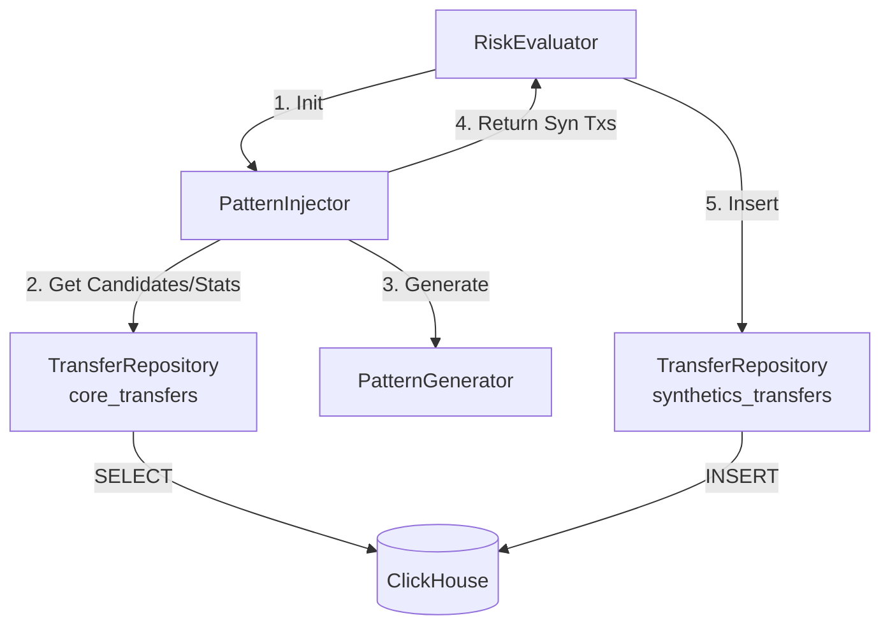

# Task: Integrate ClickHouse into Risk Evaluation Module

## Objective
Replace the Parquet-based file workflow in `packages/evaluation` with a ClickHouse-based workflow. The system will read background statistics and candidates from the `core_transfers` table and write generated synthetic transactions to the `synthetics_transfers` table.

## Planned Changes

### 1. Refactor `PatternInjector`
**Location**: `packages/evaluation/synthetic/injector.py`

- **Remove**:
    - `background_txs_path`, `features_path` arguments from `__init__`.
    - `_load_data` method and `pd.read_parquet` calls.
    - `self.bg_df` and `self.features_df` attributes.
- **Add**:
    - `repository: TransferRepository` argument to `__init__` (to access `core_transfers`).
    - `_get_background_stats()` method: Query ClickHouse for `min_time`, `max_time`, and `target_value` (75th percentile of amount).
    - `_select_victims()` implementation using SQL: `SELECT from_address FROM core_transfers GROUP BY from_address ORDER BY count() DESC LIMIT 100` (or similar heuristic).
    - `_select_exits()` implementation using SQL: `SELECT to_address FROM core_transfers GROUP BY to_address ORDER BY count() DESC LIMIT 50`.
- **Modify**:
    - `inject()` method:
        - Fetch stats and candidates using the new DB methods.
        - Generate synthetic transactions.
        - **Return**: A `pd.DataFrame` of *only* synthetic transactions (plus `ground_truth` dict), instead of merging with background data.

### 2. Refactor `RiskEvaluator`
**Location**: `packages/evaluation/risk_evaluator.py`

- **Update `__init__`**:
    - Accept `client: Client` (ClickHouse client) instead of file paths.
    - Initialize `self.core_repo = TransferRepository(client, table_name='core_transfers')`.
    - Initialize `self.syn_repo = TransferRepository(client, table_name='synthetics_transfers')`.
- **Update `generate_challenge`**:
    - Pass `self.core_repo` to `PatternInjector`.
    - Receive `synthetic_df` from `injector.inject`.
    - Write `synthetic_df` to ClickHouse using `self.syn_repo.insert_transfers(synthetic_df.to_dict('records'))`.
    - Return summary stats or the synthetic DF (optional), but do *not* return a giant merged DF.
- **Update `evaluate_miner`**:
    - (Optional/Future) Update scoring to read from DB if needed, but for now, focus on generation.

### 3. Add Repository Helper Methods (if needed)
**Location**: `packages/storage/repositories/transfer_repository.py`

- Verify if `get_transfers_view` or similar is needed.
- Ensure `insert_transfers` handles the synthetic dictionary format correctly.

## Data Flow Diagram

## Implementation Steps
1.  Verify `synthetics_transfers` table exists options (run schema execution if missing).
2.  Modify `PatternInjector` to use `TransferRepository`.
3.  Modify `RiskEvaluator` to manage repositories and write process.
4.  Test generation with a script.